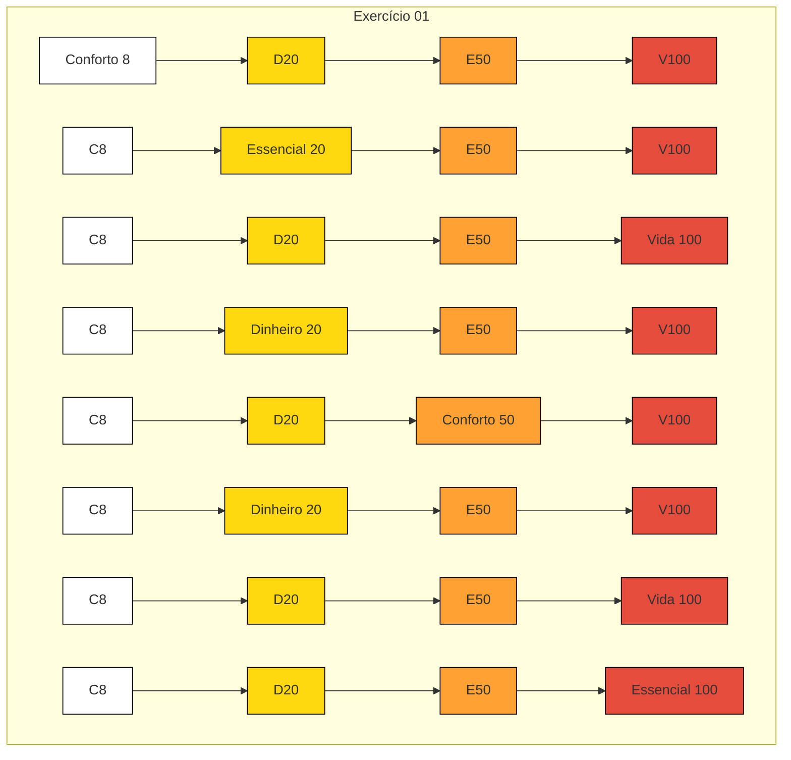
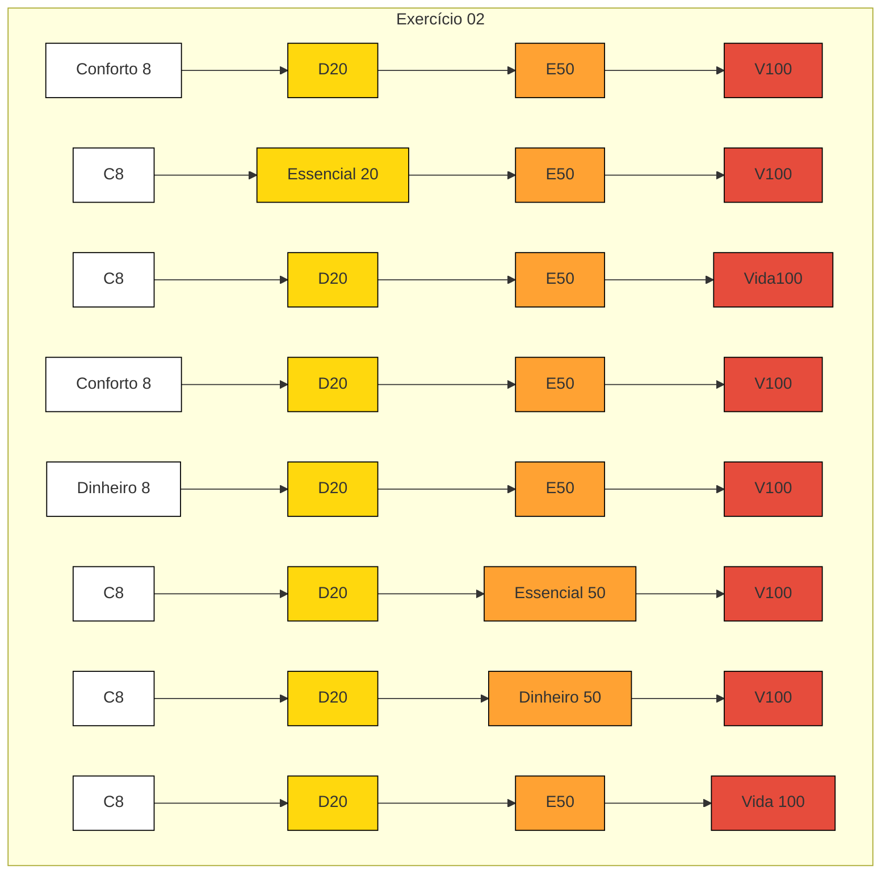

# Metodo-Agil-Crystal

```mermaid
graph TD
 subgraph Exercício 01
  A1["Conforto 8"]:::branco --> A2["D20"]:::amarelo --> A3["E50"]:::laranja --> A4["V100"]:::vermelho
    B1["C8"]:::branco --> B2["Essencial 20"]:::amarelo --> B3["E50"]:::laranja --> B4["V100"]:::vermelho
    C1["C8"]:::branco --> C2["D20"]:::amarelo --> C3["E50"]:::laranja --> C4["Vida 100"]:::vermelho
    D1["C8"]:::branco --> D2["Dinheiro 20"]:::amarelo --> D3["E50"]:::laranja --> D4["V100"]:::vermelho
    E1["C8"]:::branco --> E2["D20"]:::amarelo --> E3["Conforto 50"]:::laranja --> E4["V100"]:::vermelho
    F1["C8"]:::branco --> F2["Dinheiro 20"]:::amarelo --> F3["E50"]:::laranja --> F4["V100"]:::vermelho
    G1["C8"]:::branco --> G2["D20"]:::amarelo --> G3["E50"]:::laranja --> G4["Vida 100"]:::vermelho
    H1["C8"]:::branco --> H2["D20"]:::amarelo --> H3["E50"]:::laranja --> H4["Essencial 100"]:::vermelho
  end
 
  %% Definições de estilo
  classDef branco fill:#ffffff,stroke:#000,stroke-width:1px;
  classDef amarelo fill:#FFD80D,stroke:#000,stroke-width:1px;
  classDef laranja fill:#FFA233,stroke:#000,stroke-width:1px;
  classDef vermelho fill:#E64C3C,stroke:#000,stroke-width:1px;
 
```

```mermaid
graph TD
  subgraph Exercício 02
    A1["Conforto 8"]:::branco --> A2["D20"]:::amarelo --> A3["E50"]:::laranja --> A4["V100"]:::vermelho
    B1["C8"]:::branco --> B2["Essencial 20"]:::amarelo --> B3["E50"]:::laranja --> B4["V100"]:::vermelho
    C1["C8"]:::branco --> C2["D20"]:::amarelo --> C3["E50"]:::laranja --> C4["Vida100"]:::vermelho
    D1["Conforto 8"]:::branco --> D2["D20"]:::amarelo --> D3["E50"]:::laranja --> D4["V100"]:::vermelho
    E1["Dinheiro 8"]:::branco --> E2["D20"]:::amarelo --> E3["E50"]:::laranja --> E4["V100"]:::vermelho
    F1["C8"]:::branco --> F2["D20"]:::amarelo --> F3["Essencial 50"]:::laranja --> F4["V100"]:::vermelho
    G1["C8"]:::branco --> G2["D20"]:::amarelo --> G3["Dinheiro 50"]:::laranja --> G4["V100"]:::vermelho
    H1["C8"]:::branco --> H2["D20"]:::amarelo --> H3["E50"]:::laranja --> H4["Vida 100"]:::vermelho
  end
 
  %% Definições de estilo
  classDef branco fill:#ffffff,stroke:#000,stroke-width:1px;
  classDef amarelo fill:#FFD80D,stroke:#000,stroke-width:1px;
  classDef laranja fill:#FFA233,stroke:#000,stroke-width:1px;
  classDef vermelho fill:#E64C3C,stroke:#000,stroke-width:1px;
 
```
